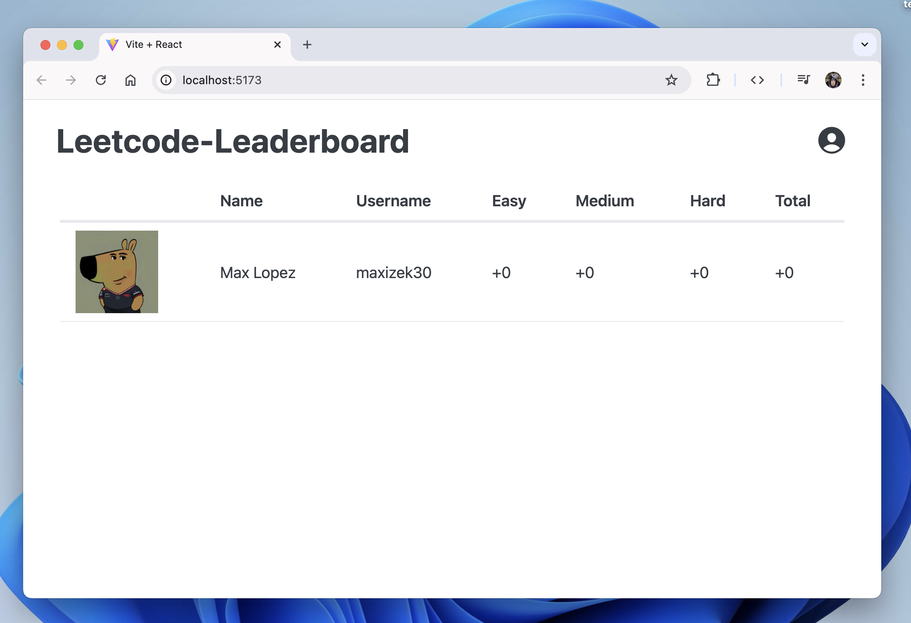

# Leetcode Leaderboard

## About

**Leetcode Leaderboard** is a platform designed to track and display weekly rankings of Leetcode users based on their problem-solving activity. It aims to help users stay motivated and foster friendly competition among peers.

## Features

- Weekly rankings of Leetcode users.
- Encourages friendly competition and motivation.
- Clean and interactive user interface.

## Technologies

- **React** for the frontend.
- **SpringBoot** for the backend.
- **Docker** for containerization.
